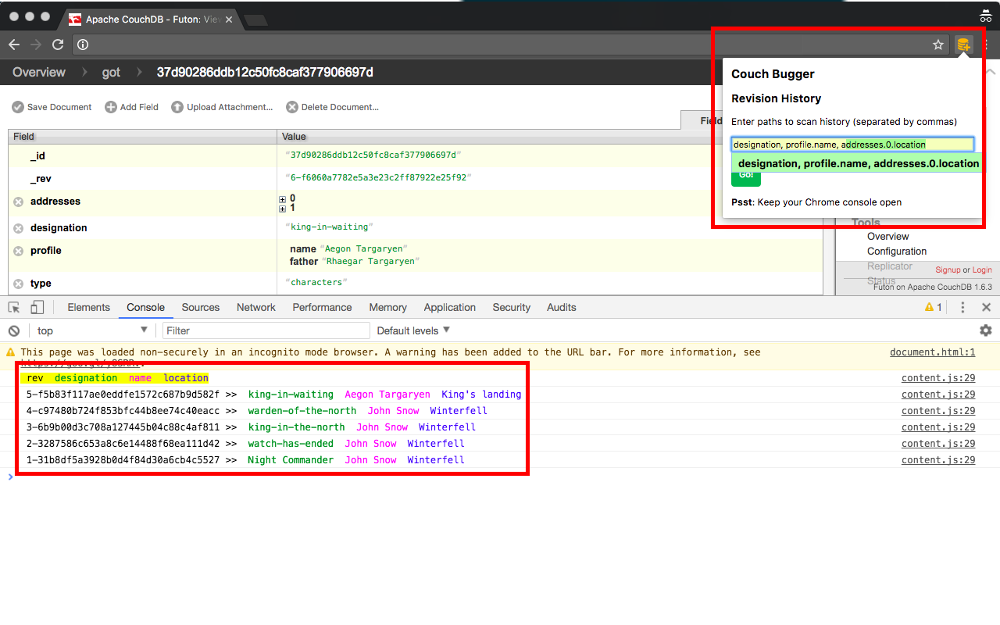

# Couch-Debug
A chrome extension for CouchDB users to debug data model changes. CouchDB saves copies of the entire json document on every save. Sometimes it is necessary to follow the audit trail of a particular value of a deeply nested key in the json document.

This extension takes an input of all the paths for which we need to retrieve the history. It scans through all available revisions of the document and fetches the value of that key from each revision. All the values are logged in the chrome console. It reads all the necessary details from the futon page of the concerned document. So it is important you have the right document page open when you use the extension

### Demo
In this example we are debugging Jon Snow's lineage (which changes from being the Night commander to king-in-waiting)


```
{
   "_id": "37d90286ddb12c50fc8caf377906697d",
   "_rev": "6-f6060a7782e5a3e23c2ff87922e25f92",
   "type": "characters",
   "profile": {
       "name": "Aegon Targaryen",
       "father": "Rhaegar Targaryen"
   },
   "designation": "king-in-waiting",
   "addresses": [
       {
           "type": "home",
           "location": "King's landing"
       },
       {
           "type": "work",
           "location": "Westeros"
       }
   ]
}
```


We can search for `designation`, `profile.name`, `addresses.0.location`



### Compatibility

This is tested with CouchDB v1.6.3 but should work with almost all versions. Works only in the latest Chrome browsers that support ES6 
